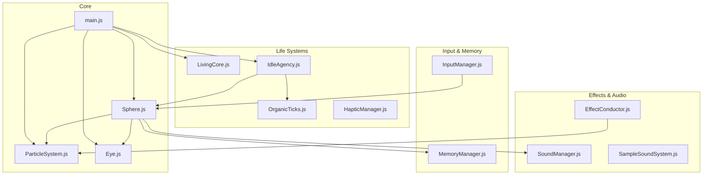

# Архитектура: SPHERE-777

> **Stage 8** — Living Organism with Idle Agency

---

## Обзор

Интерактивная 3D-сфера из 5,000 частиц — **живое существо с характером**, которое дышит, чувствует, запоминает и **само проявляет инициативу**.



---

## Модули (13 файлов)

### Core

| Модуль | Ответственность |
|--------|-----------------|
| `main.js` | Three.js init, RAF loop, post-processing |
| `Sphere.js` | Эмоциональная машина, координация |
| `ParticleSystem.js` | GPU рендер, GLSL шейдеры |
| `Eye.js` | Радужка, зрачок, моргание, слежение |

### Life Systems (NEW)

| Модуль | Ответственность |
|--------|-----------------|
| `LivingCore.js` | 3 слоя внутреннего свечения |
| `OrganicTicks.js` | Автономные микро-движения (twitch, stretch, shiver, glance) |
| `IdleAgency.js` | Mood state machine, face-viewer rotation, z-bounce |
| `HapticManager.js` | Вибрация телефона, BPM паттерны |

### Input & Memory

| Модуль | Ответственность |
|--------|-----------------|
| `InputManager.js` | Mouse/Touch, gestures (9 типов) |
| `MemoryManager.js` | Trust Index, Ghost/Warm Traces |

### Effects & Audio

| Модуль | Ответственность |
|--------|-----------------|
| `EffectConductor.js` | Стохастические эффекты |
| `SoundManager.js` | Web Audio base |
| `SampleSoundSystem.js` | Sample-based звук с LFO модуляцией |

---

## Эмоциональные фазы

```
PEACE → LISTENING → TENSION → BLEEDING → TRAUMA → HEALING
  ↑                                                    ↓
  └────────────────────────────────────────────────────┘
```

### Idle Moods (IdleAgency)

| Время idle | Mood | Поведение |
|------------|------|-----------|
| 0-2с | `calm` | Обычное дыхание |
| 2-4с | `curious` | Глаз блуждает чаще |
| 4-6с | `restless` | Микроповороты, ticks x2 |
| 6с+ | `attention-seeking` | Z-bounce, вспышки, **поворот к камере** |

---

## Gesture → Emotion Mapping

| Жест | Эмоция | Затухание |
|------|--------|-----------|
| poke, tremble, flick | alert | 2.0/с |
| spiral | bleeding | 0.2/с |
| hold >0.5s | trust | 0.3/с |
| hover, stroke, tap | peace | — |

---

## Файловая структура

```
sphere-777/
├── index.html
├── style.css
├── package.json
├── vite.config.js
├── CLAUDE.md
├── docs/
│   ├── ARCHITECTURE.md      # ← этот файл
│   ├── VISION.md            # Концепция
│   ├── NEXT_SESSION.md      # Текущий статус
│   ├── IMPLEMENTATION_ORGANIC_LIFE.md  # Детальные спеки
│   ├── HANDOFF_IDLE_AGENCY.md          # Актуальный handoff
│   └── HANDOFF_GESTURE_EMOTION_MAPPING.md
└── src/
    ├── main.js
    ├── Sphere.js
    ├── ParticleSystem.js
    ├── Eye.js
    ├── LivingCore.js
    ├── OrganicTicks.js
    ├── IdleAgency.js
    ├── HapticManager.js
    ├── InputManager.js
    ├── MemoryManager.js
    ├── EffectConductor.js
    ├── SoundManager.js
    └── SampleSoundSystem.js
```

---

## Зависимости

```json
{
  "three": "^0.160.0",
  "vite": "^5.0.0"
}
```

Минимализм. Никаких лишних библиотек.

---

*Updated: 2026-01-11 — Stage 8 Living Organism*
