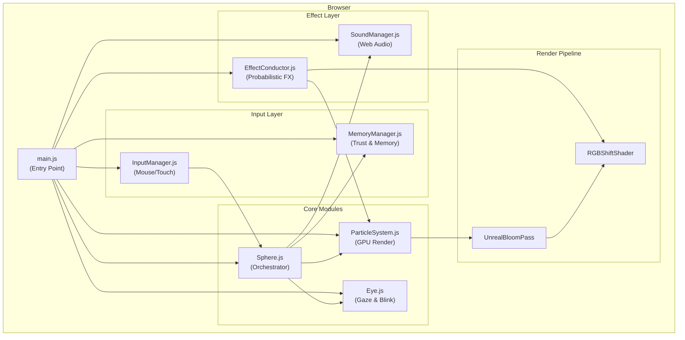

# Архитектура: SPHERE Prototype

> Stage 6 Complete — Deep Interaction + Mobile + Sound + Emotional Memory

---

## Обзор системы

Интерактивная 3D-сфера из 5,000 частиц — живое существо, которое дышит, чувствует и запоминает.



---

## Компоненты

### 1. main.js — Entry Point

**Ответственность:**
- Three.js инициализация (scene, camera, renderer)
- Post-processing pipeline (Bloom, Chromatic Aberration)
- RAF loop (requestAnimationFrame)
- Responsive size multiplier для мобильных

**Ключевые параметры:**
| Параметр | Desktop | Mobile |
|----------|---------|--------|
| Частицы | 5000 | 2000 |
| Size Multiplier | 1.0x | 1.4-1.8x |

---

### 2. Sphere.js — Orchestrator

**Ответственность:**
- Эмоциональная машина состояний
- Координация всех модулей
- Физика качения (rolling physics)
- Обработка жестов

**Состояния:**
```
PEACE → LISTENING → TENSION → BLEEDING → TRAUMA → HEALING
  ↑                                                    ↓
  └────────────────────────────────────────────────────┘
```

**Ключевые параметры:**
| Параметр | Значение |
|----------|----------|
| breathSpeed | 0.3-0.8 (адаптивный) |
| tensionDecay | 0.08 × trustMod |
| traumaThreshold | 0.7 - (1-trust)×0.2 |

---

### 3. ParticleSystem.js — GPU Renderer

**Ответственность:**
- BufferGeometry с Fibonacci-распределением
- GLSL шейдеры (vertex + fragment)
- Дыхание (breathing pulsation)
- Cursor proximity effects
- Ghost traces rendering

**Uniforms:**
```glsl
uniform float uTime;
uniform float uBreathPhase;
uniform vec3 uCursorPos;
uniform float uCursorInfluence;
uniform float uSize;              // Dynamic sizing
uniform float uGoosebumpAmount;   // Dual-layer waves
uniform float uSparkleIntensity;  // Effect Conductor
uniform float uDynamicSizeAmount; // Effect Conductor
```

---

### 4. Eye.js — Organic Eye

**Ответственность:**
- Частицы радужки (hypotrochoid pattern)
- Soul Spark (центральная точка)
- Gaze tracking (следит за курсором)
- Blinking (случайное + эмоциональное)

**Ключевые параметры:**
| Параметр | Значение |
|----------|----------|
| Положение | North pole (0, 0, 1.5) |
| Частицы | ~200 |
| Blink interval | 3-7 сек |

---

### 5. InputManager.js — Input Layer

**Ответственность:**
- Mouse/Touch position tracking
- Velocity & acceleration
- Gesture recognition (stroke, poke, orbit, tremble)
- Approach speed detection

**Жесты:**
| Жест | Триггер | Эффект |
|------|---------|--------|
| stroke | smooth, slow motion | Успокаивает |
| poke | quick tap/click | Вздрагивает |
| orbit | circular motion | Гипноз |
| tremble | erratic, fast motion | Нервничает |

---

### 6. MemoryManager.js — Emotional Memory

**Ответственность:**
- Trust Index (0-1, persistent в localStorage)
- Ghost Traces (визуальные шрамы)
- Baseline anxiety модификация
- Debounced persistence

**Trust Index влияние:**
| Trust | Tension Decay | Trauma Threshold | Peace Color |
|-------|---------------|------------------|-------------|
| 1.0 | 1.0x | 0.7 | Насыщенный фиолетовый |
| 0.5 | 0.8x | 0.6 | Нейтральный |
| 0.1 | 0.6x | 0.5 | Серо-холодный |

---

### 7. EffectConductor.js — Living Chaos

**Ответственность:**
- Стохастические визуальные эффекты
- Probability-based activation
- Smooth interpolation

**Эффекты:**
| Эффект | Trigger | Визуал |
|--------|---------|--------|
| Dynamic Size | PEACE + random | Particles grow/shrink |
| Sparkle | TENSION + random | Bright flashes |
| Chromatic Aberration | tension > 0.5 | RGB split |

---

### 8. SoundManager.js — Web Audio

**Ответственность:**
- Procedural sound generation
- Emotional state sync
- Touch/gesture sounds

**Звуковые слои:**
| Состояние | Звук |
|-----------|------|
| PEACE | Sub-bass hum (35Hz) |
| LISTENING | Soft whisper |
| TENSION | High whine (2000Hz) |
| BLEEDING | Distortion + pain |

---

## Потоки данных

```
User Input (mouse/touch)
       │
       ▼
InputManager.update()
       │
       ├──→ position, velocity, gestures
       │
       ▼
Sphere.update()
       │
       ├──→ State transitions
       │         │
       │         ├──→ MemoryManager.recordInteraction()
       │         │         └──→ trustIndex ↑↓
       │         │
       │         ├──→ SoundManager.setPhase()
       │         │
       │         └──→ ParticleSystem.setBreathPhase()
       │
       ▼
EffectConductor.update()
       │
       ├──→ dynamicSizeAmount, sparkleIntensity, chromaticAberration
       │
       ▼
ParticleSystem.update() + Shaders
       │
       ▼
Post-Processing (Bloom → Chromatic)
       │
       ▼
Canvas Output
```

---

## Файловая структура

```
prototype-sphere/
├── index.html
├── style.css
├── package.json
├── vite.config.js
├── PHILOSOPHY.md        # → docs/PHILOSOPHY.md (moved)
└── src/
    ├── main.js          # Entry point, orchestration
    ├── Sphere.js        # Emotional state machine
    ├── ParticleSystem.js # GPU particles, shaders
    ├── Eye.js           # Organic particle eye
    ├── InputManager.js  # Mouse/touch, gestures
    ├── MemoryManager.js # Trust, ghost traces
    ├── EffectConductor.js # Probabilistic effects
    └── SoundManager.js  # Web Audio procedural
```

---

## Зависимости

```json
{
  "dependencies": {
    "three": "^0.160.0"
  },
  "devDependencies": {
    "vite": "^5.0.0"
  }
}
```

Минимализм. Никаких дополнительных библиотек.

---

## Точки расширения

| Точка | Как расширить |
|-------|---------------|
| Новые жесты | `InputManager.js` → `_detectGesture()` |
| Новые эмоции | `Sphere.js` → `_processGesture()`, добавить phase |
| Новые эффекты | `EffectConductor.js` → добавить effect layer |
| Новые звуки | `SoundManager.js` → добавить oscillator |

---

*Updated: 2026-01-08 — Stage 6 Complete*
